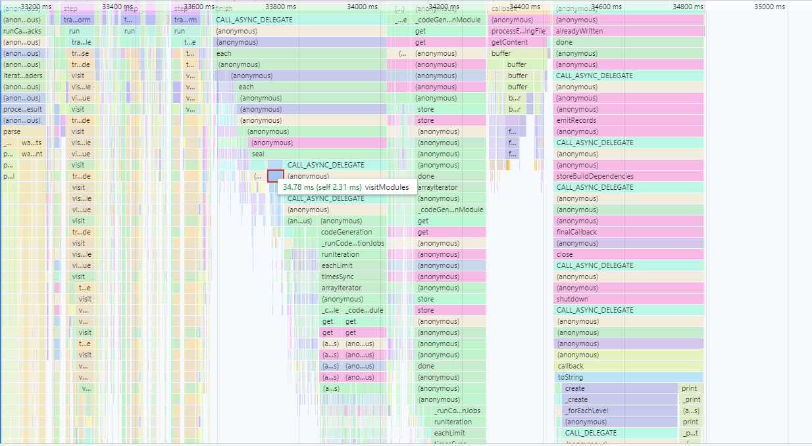
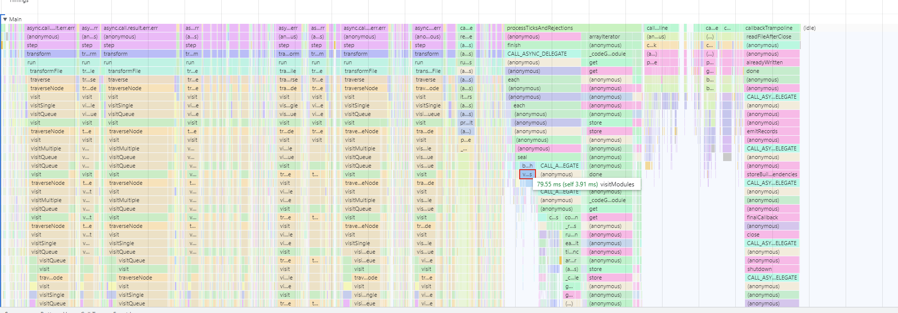

# Webpack 5 test repo

This repo shows performance slowdown and higher memory consumption in webpack when using async dynamic imports instead of sync requires.

> **Note**
>
> The results may differ on your machine.
> Also the repo doesn't have such noticeable difference in build time and memory consumption as it happens for real world projects. I've tried my best to replicate it, but in real project it shows really significant difference.

## How to reproduce

1. Clone this repo
2. Run `npm ci`
3. Run `npm run build`

   This will show next logs:
   ```
    _____Current Memory rss:  309133312
    asset main.js 2.34 MiB [compared for emit] (name: main)
    orphan modules 633 KiB [orphan] 103 modules
    runtime modules 3.05 KiB 7 modules
    modules by path ./node_modules/ 1.85 MiB 296 modules
    modules by path ./src/ 6.6 KiB
    optional modules 4.19 KiB [optional]
        ./src/dynamic/1.js 143 bytes [optional] [built] [code generated]
        ./src/dynamic/1 - Copy.js 143 bytes [optional] [built] [code generated]
        ./src/dynamic/1 - Copy (2).js 143 bytes [optional] [built] [code generated]
        + 47 modules
    ./src/index.js 96 bytes [built] [code generated]
    ./src/dynamic/ sync ^\.\/.*$ 2.05 KiB [built] [code generated]
    ./src/dynamic/3.js 66 bytes [built] [code generated]
    ./src/dynamic/6.js 63 bytes [built] [code generated]
    ./src/dynamic/7.js 76 bytes [built] [code generated]

    DEBUG LOG from webpack.buildChunkGraph
    <t> visitModules: prepare: 8.2202 ms
    <t> visitModules: visiting: 13.0812 ms
        739 queue items processed (352 blocks)
        0 chunk groups connected
        0 chunk groups processed for merging (0 module sets, 0 forked, 0 + 0 modules forked, 0 + 0 modules merged into fork, 0 resulting modules)
        0 chunk group info updated (0 already connected chunk groups reconnected)
    <t> visitModules: 15.0455 ms
    <t> connectChunkGroups: 0.1574 ms
    <t> cleanup: 0.0977 ms

    webpack 5.87.0 compiled successfully in 17696 ms
   ```

    

4. Go to `./src/index.js` and comment first line and uncomment second line
5. Run again `npm run build` to see
    ```
    _____Current Memory rss:  353538048
    asset src_dynamic_1_-_Copy_2_js.js 2.11 MiB [compared for emit]
    asset src_dynamic_1_-_Copy_3_js.js 2.11 MiB [compared for emit]
    asset src_dynamic_1_-_Copy_4_js.js 2.11 MiB [compared for emit]
    asset src_dynamic_1_-_Copy_5_js.js 2.11 MiB [compared for emit]
    asset src_dynamic_1_-_Copy_js.js 2.11 MiB [compared for emit]
    asset src_dynamic_1_js.js 2.11 MiB [compared for emit]
    asset src_dynamic_2_-_Copy_2_js.js 1.48 MiB [compared for emit]
    asset src_dynamic_2_-_Copy_3_js.js 1.48 MiB [compared for emit]
    asset src_dynamic_2_-_Copy_4_js.js 1.48 MiB [compared for emit]
    asset src_dynamic_2_-_Copy_5_js.js 1.48 MiB [compared for emit]
    asset src_dynamic_2_-_Copy_js.js 1.48 MiB [compared for emit]
    asset src_dynamic_2_js.js 1.48 MiB [compared for emit]
    asset src_dynamic_8_-_Copy_2_js.js 1.17 MiB [compared for emit]
    asset src_dynamic_8_-_Copy_3_js.js 1.17 MiB [compared for emit]
    + 41 assets
    orphan modules 633 KiB [orphan] 103 modules
    runtime modules 8.89 KiB 12 modules
    modules by path ./node_modules/ 1.85 MiB 296 modules
    modules by path ./src/ 4.7 KiB
    optional modules 4.19 KiB [optional]
        ./src/dynamic/1.js 143 bytes [optional] [built] [code generated]
        ./src/dynamic/1 - Copy.js 143 bytes [optional] [built] [code generated]
        ./src/dynamic/1 - Copy (2).js 143 bytes [optional] [built] [code generated]
        + 47 modules
    ./src/index.js 96 bytes [built] [code generated]
    ./src/dynamic/ lazy ^\.\/.*$ namespace object 160 bytes [built] [code generated]
    ./src/dynamic/2.js 69 bytes [built] [code generated]
    ./src/dynamic/3.js 66 bytes [built] [code generated]
    ./src/dynamic/6.js 63 bytes [built] [code generated]
    ./src/dynamic/7.js 76 bytes [built] [code generated]

    <t> visitModules: prepare: 0.672858 ms
    <t> visitModules: visiting: 3.224541 ms
    <t> visitModules: calculating available modules: 0.475475 ms
    <t> visitModules: merging available modules: 0.488474 ms
    <t> visitModules: check modules for revisit: 0.187958 ms
    <t> visitModules: prepare: 5.469101 ms
    <t> visitModules: visiting: 56.123377 ms
        20776 queue items processed (9938 blocks)
        108 chunk groups connected
        108 chunk groups processed for merging (108 module sets, 0 forked, 0 + 0 modules forked, 0 + 0 modules merged into fork, 0 resulting modules)
        108 chunk group info updated (0 already connected chunk groups reconnected)
    <t> visitModules: 62.310184 ms
    <t> connectChunkGroups: 1.191125 ms
    <t> cleanup: 0.305825 ms

    webpack 5.87.0 compiled successfully in 20919 ms
    ```

    
6. You should notice that the second build requires more time and memory